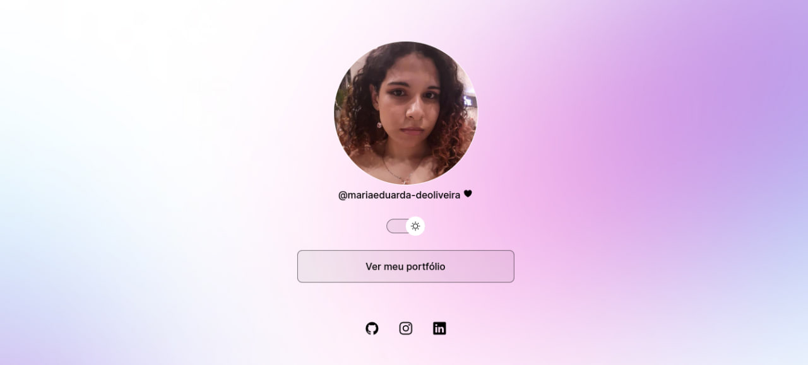

<h1 align="center">DevLinks</h1>

Programa exclusivo e gratuito, promovido pela Rocketseat para ensino de tecnologias WEB.

    <a href="#-tecnologias">Tecnologias</a>&nbsp;&nbsp;&nbsp;|&nbsp;&nbsp;
    <a href="#-layout">Layout</a>&nbsp;&nbsp;&nbsp;|&nbsp;&nbsp;
    <a href="#-licença">Licença</a>

 

## Tecnologias
Esse projeto foi desenvolvido com:
- HTML
- CSS
- Javascript
- Git e Github
- Figma

## Layout
Você pode visualizar o layout original deste projeto através [DESSE LINK](https://www.figma.com/community/file/1187422022288947321). É necessário ter uma conta no [FIGMA](https://figma.com) para acessá-lo.

## Licença
Esse projeto está sob a licença MIT.

--- 
Feito com ♥️ by Rocketseat. [Participe da nossa comunidade!](https://discord.gg/rocketseat)